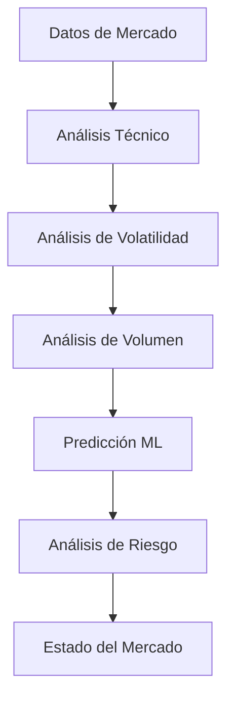
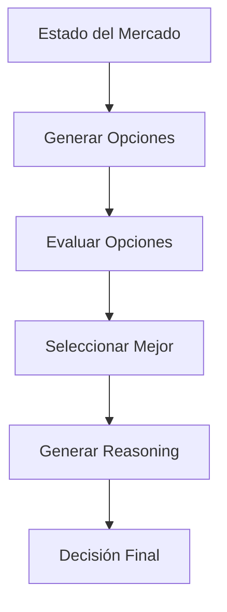
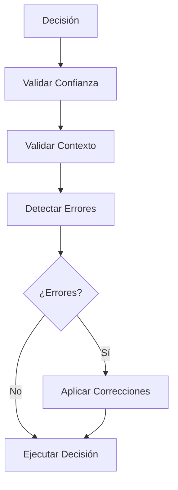
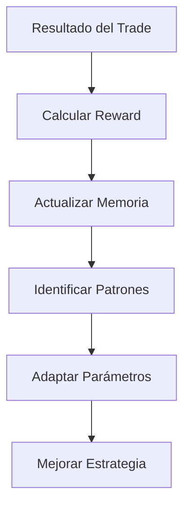

# 🤖 agents/ - Sistema de Agentes de IA para Trading

> **Propósito**: Agente de IA autónomo, autodidacta y autocorrectivo que integra todo el sistema de ML y trading para operar de forma completamente independiente.

## 🎯 CARACTERÍSTICAS PRINCIPALES

### **🧠 Autonomía Completa**
- **Toma de decisiones independiente** sin intervención humana
- **Análisis autónomo** del estado del mercado
- **Ejecución automática** de operaciones de trading
- **Monitoreo continuo** de performance y riesgos

### **🎓 Aprendizaje Autodidacta**
- **Aprendizaje continuo** de cada experiencia de trading
- **Identificación de patrones** en el mercado
- **Adaptación dinámica** a condiciones cambiantes
- **Mejora constante** de estrategias y parámetros

### **🔧 Autocorrección Inteligente**
- **Detección automática** de errores y anomalías
- **Corrección proactiva** de parámetros y estrategias
- **Validación continua** de decisiones
- **Recuperación automática** de errores críticos

## 📁 ESTRUCTURA DE ARCHIVOS

```
agents/
├── __init__.py                    # Inicialización del módulo
├── trading_agent.py              # 🤖 Agente principal de trading
├── autonomous_decision_engine.py # 🧠 Motor de decisiones autónomas
├── self_learning_system.py       # 🎓 Sistema de aprendizaje autodidacta
├── self_correction_mechanism.py  # 🔧 Mecanismo de autocorrección
└── README.md                     # 📄 Esta documentación
```

## 🏗️ ARQUITECTURA DEL AGENTE

### **TradingAgent - Agente Principal**
```python
class TradingAgent:
    """Agente principal que orquesta todo el sistema"""
    
    def __init__(self):
        self.decision_engine = AutonomousDecisionEngine()
        self.learning_system = SelfLearningSystem()
        self.correction_mechanism = SelfCorrectionMechanism()
        self.memory = AgentMemory()
    
    async def start_autonomous_trading(self):
        """Inicia el trading completamente autónomo"""
        
    async def _autonomous_trading_cycle(self):
        """Ciclo principal de trading autónomo"""
```

### **AutonomousDecisionEngine - Motor de Decisiones**
```python
class AutonomousDecisionEngine:
    """Motor que toma decisiones de trading de forma autónoma"""
    
    async def analyze_market_state(self, market_data):
        """Analiza el estado actual del mercado"""
        
    async def make_decision(self, analysis):
        """Toma una decisión basada en el análisis"""
        
    def _generate_decision_reasoning(self, decision, analysis):
        """Genera reasoning explicable para la decisión"""
```

### **SelfLearningSystem - Sistema de Aprendizaje**
```python
class SelfLearningSystem:
    """Sistema que aprende continuamente de experiencias"""
    
    async def learn_from_episode(self, episode):
        """Aprende de un episodio de trading"""
        
    async def adapt_to_conditions(self, performance, market_changes):
        """Se adapta a condiciones cambiantes"""
        
    def _identify_patterns(self, episode):
        """Identifica patrones en los datos"""
```

### **SelfCorrectionMechanism - Autocorrección**
```python
class SelfCorrectionMechanism:
    """Mecanismo que detecta y corrige errores automáticamente"""
    
    async def validate_decision(self, decision, analysis):
        """Valida una decisión antes de ejecutarla"""
        
    async def detect_errors(self, context):
        """Detecta errores en el sistema"""
        
    async def apply_corrections(self, errors):
        """Aplica correcciones para errores detectados"""
```

## 🔄 FLUJO DE TRADING AUTÓNOMO

### **1. Análisis Continuo**


### **2. Toma de Decisiones**


### **3. Validación y Corrección**


### **4. Aprendizaje y Adaptación**


## 🧠 CAPACIDADES INTELIGENTES

### **Análisis de Mercado Avanzado**
- **Detección de tendencias** (bull, bear, sideways)
- **Análisis de volatilidad** (baja, media, alta)
- **Análisis de volumen** (normal, alto, bajo)
- **Identificación de soporte/resistencia**
- **Detección de regímenes de mercado**

### **Toma de Decisiones Inteligente**
- **Evaluación multi-factor** (ML, técnico, riesgo, contexto)
- **Scoring de oportunidades** basado en múltiples métricas
- **Reasoning explicable** para cada decisión
- **Adaptación dinámica** de umbrales y parámetros

### **Aprendizaje Continuo**
- **Memoria episódica** de todas las experiencias
- **Memoria semántica** de patrones y reglas
- **Identificación automática** de patrones exitosos
- **Adaptación proactiva** a cambios del mercado

### **Autocorrección Inteligente**
- **Detección automática** de errores de performance
- **Validación continua** de decisiones
- **Corrección proactiva** de parámetros
- **Recuperación automática** de errores críticos

## ⚙️ CONFIGURACIÓN

### **Configuración del Agente**
```yaml
ai_agent:
  general:
    enabled: true
    mode: "autonomous"
    learning_enabled: true
    self_correction_enabled: true
    
  decision_engine:
    min_confidence: 0.7
    risk_tolerance: 0.5
    opportunity_threshold: 0.6
    
  learning_system:
    learning_rate: 0.01
    memory_size: 1000
    pattern_threshold: 0.7
    
  self_correction:
    correction_mode: "automatic"
    error_thresholds:
      prediction_accuracy: 0.6
      decision_confidence: 0.5
```

## 🚀 USO DEL AGENTE

### **Inicialización Básica**
```python
from agents.trading_agent import TradingAgent

# Crear agente
agent = TradingAgent()

# Inicializar
await agent.initialize()

# Iniciar trading autónomo
await agent.start_autonomous_trading()
```

### **Monitoreo del Agente**
```python
# Obtener estado del agente
status = agent.get_agent_status()
print(f"Estado: {status['state']}")
print(f"Activo: {status['is_active']}")
print(f"Performance: {status['performance']}")

# Obtener insights
insights = agent.get_agent_insights()
print(f"Análisis de performance: {insights['performance_analysis']}")
print(f"Recomendaciones: {insights['recommendations']}")
```

### **Control del Agente**
```python
# Detener trading
await agent.stop_trading()

# Obtener estadísticas
stats = agent.get_agent_status()
print(f"Total trades: {stats['performance']['total_trades']}")
print(f"Trades exitosos: {stats['performance']['profitable_trades']}")
```

## 🧪 TESTING

### **Ejecutar Tests del Agente**
```bash
python test_ai_agent.py
```

### **Tests Incluidos**
- ✅ **Inicialización del agente**
- ✅ **Motor de decisiones**
- ✅ **Sistema de aprendizaje**
- ✅ **Mecanismo de autocorrección**
- ✅ **Integración completa**

## 📊 MÉTRICAS Y MONITOREO

### **Métricas del Agente**
- **Performance de trading**: Win rate, PnL, Sharpe ratio
- **Calidad de decisiones**: Accuracy, confidence calibration
- **Aprendizaje**: Episodios aprendidos, patrones identificados
- **Autocorrección**: Errores detectados, correcciones aplicadas

### **Insights Inteligentes**
- **Análisis de performance** reciente
- **Patrones identificados** en el mercado
- **Recomendaciones** de mejora
- **Tendencias de aprendizaje** del agente

## 🔒 SEGURIDAD Y CONTROL

### **Controles de Seguridad**
- **Límites de trading** diarios y por posición
- **Circuit breakers** para pérdidas excesivas
- **Validación continua** de decisiones
- **Modo de emergencia** con parada automática

### **Override Humano**
- **Capacidad de intervención** manual cuando sea necesario
- **Pausa del agente** en situaciones críticas
- **Modificación de parámetros** en tiempo real
- **Logs detallados** para auditoría

## 🔮 EXPANSIONES FUTURAS

### **Capacidades Avanzadas**
- **Multi-símbolo** trading simultáneo
- **Análisis de sentimiento** de noticias y redes sociales
- **Optimización de portfolio** dinámica
- **Trading de alta frecuencia** con micro-decisiones

### **Integración con IA Avanzada**
- **Modelos de lenguaje** para análisis de noticias
- **Reinforcement Learning** avanzado
- **Meta-learning** para adaptación rápida
- **Federated learning** con otros agentes

## 📚 DOCUMENTACIÓN TÉCNICA

### **Arquitectura Detallada**
- **Patrones de diseño** utilizados
- **Flujos de datos** entre componentes
- **Interfaces** y contratos de API
- **Manejo de errores** y recuperación

### **Guías de Desarrollo**
- **Cómo agregar** nuevas capacidades
- **Cómo modificar** algoritmos de decisión
- **Cómo integrar** nuevos modelos ML
- **Cómo personalizar** el comportamiento

---

**📝 Nota para Desarrolladores**: Este agente representa el estado del arte en trading autónomo con IA. Cada componente está diseñado para ser modular, extensible y mantenible. El sistema está preparado para evolucionar y adaptarse a nuevas tecnologías y requerimientos del mercado.

**🎯 Objetivo**: Crear un agente que no solo sea autónomo, sino que mejore continuamente su performance a través del aprendizaje y la autocorrección, proporcionando una ventaja competitiva sostenible en los mercados financieros.
