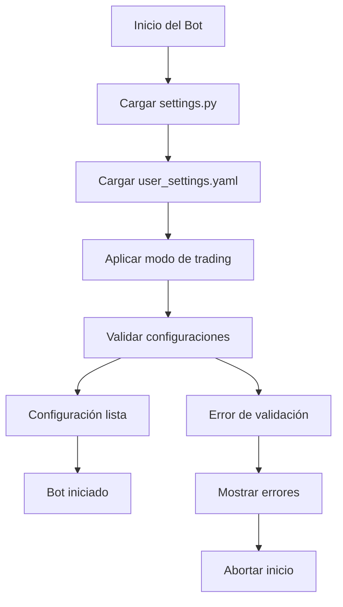

# 📁 config/ - Sistema de Configuración

> **Propósito**: Gestión centralizada de todas las configuraciones del bot, tanto técnicas como de usuario.

## 🎯 ORGANIZACIÓN DE ARCHIVOS

```
config/
├── __init__.py                 # Inicialización del módulo
├── settings.py                 # ⚙️ Configuración base del sistema
├── config_loader.py            # 📥 Cargador de configuración YAML
├── user_settings.yaml          # 👤 Configuración personalizable del usuario
├── symbols_config.yaml         # 📊 Configuración multi-symbol (futuro)
├── strategies_config.yaml      # 🎯 Configuración de estrategias (futuro)
├── risk_profiles.yaml          # 🛡️ Perfiles de riesgo predefinidos (futuro)
└── README.md                   # 📄 Esta documentación
```

## 🔧 FUNCIONALIDADES PRINCIPALES

### **1. settings.py - Configuración Base**
```python
Responsabilidades:
├── 🏗️ Definir estructuras de configuración (dataclasses)
├── 🌍 Gestionar entornos (development, backtesting, paper, live)
├── 📁 Configurar paths y directorios del proyecto
├── 🔧 Establecer configuraciones por defecto
├── ✅ Validar integridad de configuraciones
└── 📊 Proveer configuración global al sistema
```

**Clases Principales:**
- `Environment`: Enum para entornos de ejecución
- `DatabaseConfig`: Configuración de base de datos
- `BitgetConfig`: Configuración API de Bitget
- `TradingConfig`: Parámetros de trading
- `MLConfig`: Configuración del modelo ML
- `MonitoringConfig`: Configuración de monitoreo
- `GlobalConfig`: Orquestador principal

### **2. config_loader.py - Cargador YAML**
```python
Responsabilidades:
├── 📥 Cargar configuraciones desde archivos YAML
├── 🔄 Aplicar configuraciones del usuario al sistema base
├── ✅ Validar configuraciones del usuario
├── 🎭 Gestionar modos de trading (conservative/moderate/aggressive)
├── 🔧 Proveer acceso fácil a configuraciones anidadas
└── 💾 Guardar cambios de configuración
```

**Funciones Clave:**
- `load_user_config()`: Carga configuración desde YAML
- `get_trading_mode_settings()`: Obtiene configuraciones por modo
- `apply_to_base_config()`: Aplica configuración del usuario
- `validate_config()`: Valida configuraciones
- `save_config()`: Guarda cambios

### **3. user_settings.yaml - Configuración del Usuario**
```yaml
Secciones Principales:
├── bot_settings          # Configuración general del bot
├── capital_management    # Gestión de capital y riesgo
├── trading_settings      # Configuración de trading
├── ai_model_settings     # Configuración del modelo IA
├── reward_system         # Sistema de recompensas/penalizaciones
├── monitoring           # Configuración de monitoreo
└── advanced_settings    # Configuraciones avanzadas
```

## 🎮 MODOS DE TRADING

### **Conservative Mode**
```yaml
Características:
├── Max Risk per Trade: 1.0%
├── Min Confidence: 75%
├── Stop Loss: 1.5%
├── Take Profit: 3.0%
└── Max Daily Trades: 3
```

### **Moderate Mode** (Por defecto)
```yaml
Características:
├── Max Risk per Trade: 2.0%
├── Min Confidence: 65%
├── Stop Loss: 2.0%
├── Take Profit: 4.0%
└── Max Daily Trades: 5
```

### **Aggressive Mode**
```yaml
Características:
├── Max Risk per Trade: 3.0%
├── Min Confidence: 55%
├── Stop Loss: 2.5%
├── Take Profit: 5.0%
└── Max Daily Trades: 10
```

### **Custom Mode**
- Usa exactamente los valores configurados en el YAML
- Control total sobre todos los parámetros

## 🔄 FLUJO DE CONFIGURACIÓN



## 📚 GUÍAS DE USO

### **Para Desarrolladores (Cursor/Claude)**

#### **Acceder a configuraciones:**
```python
from config.settings import config
from config.config_loader import user_config

# Configuración base
symbol = config.trading.symbol
api_key = config.bitget.api_key

# Configuración del usuario
trading_mode = user_config.get_trading_mode()
capital_settings = user_config.get_capital_settings()
```

#### **Validar configuraciones:**
```python
# Validar configuración base
errors = config.validate_config()
if errors:
    print(f"Errores: {errors}")

# Validar configuración de usuario
user_errors = user_config.validate_config()
```

#### **Aplicar configuraciones:**
```python
# Aplicar configuración del usuario al sistema
user_config.apply_to_base_config()
```

### **Para Usuarios**

#### **Personalizar el bot:**
1. Editar `config/user_settings.yaml`
2. Cambiar `trading_mode` (conservative/moderate/aggressive/custom)
3. Ajustar `capital_management` según tu capital
4. Configurar `reward_system` para el aprendizaje
5. Reiniciar el bot para aplicar cambios

#### **Configuraciones críticas:**
```yaml
# ⚠️ CONFIGURACIONES IMPORTANTES
capital_management:
  initial_balance: 1000.0      # TU CAPITAL REAL
  max_risk_per_trade: 2.0      # % máximo por trade
  max_daily_loss_pct: 5.0      # % pérdida máxima diaria

ai_model_settings:
  confidence:
    min_confidence_to_trade: 65.0  # Confianza mínima para operar
```

## 🔮 EXPANSIONES FUTURAS

### **symbols_config.yaml**
```yaml
# Configuración multi-symbol
symbols:
  BTCUSDT:
    allocation_pct: 30.0
    risk_multiplier: 1.0
  ETHUSDT:
    allocation_pct: 25.0
    risk_multiplier: 1.2
  # ... más símbolos
```

### **strategies_config.yaml**
```yaml
# Múltiples estrategias
strategies:
  trend_following:
    enabled: true
    allocation: 40.0
  mean_reversion:
    enabled: true
    allocation: 30.0
  # ... más estrategias
```

### **risk_profiles.yaml**
```yaml
# Perfiles de riesgo predefinidos
profiles:
  ultra_conservative:
    max_risk_per_trade: 0.5
    max_daily_loss: 2.0
  day_trader:
    max_risk_per_trade: 5.0
    max_daily_trades: 50
```

## 🛡️ SEGURIDAD

### **Archivos Sensibles**
- ❌ **NO subir** archivos con credenciales reales
- ✅ **Usar** `.env` para credenciales
- ✅ **Validar** todas las configuraciones antes de usar
- ✅ **Hacer backup** de configuraciones funcionando

### **Validaciones de Seguridad**
```python
Checks Automáticos:
├── ✅ Capital inicial > 0
├── ✅ Risk per trade < 10%
├── ✅ Daily loss limit < 50%
├── ✅ Confidence threshold entre 50-95%
├── ✅ Credenciales API configuradas
└── ✅ Símbolos válidos para Bitget
```

## 🚀 INTEGRACIÓN CON OTROS MÓDULOS

```python
Conexiones:
├── 📊 data/ - Usa configuraciones de símbolos y timeframes
├── 🧠 models/ - Usa configuraciones de ML y reentrenamiento
├── ⚡ trading/ - Usa configuraciones de trading y riesgo
├── 📱 monitoring/ - Usa configuraciones de dashboard y alertas
└── 🔙 backtesting/ - Usa configuraciones de testing
```

---

**📝 Nota para Cursor**: Este módulo es la columna vertebral del bot. Siempre verificar configuraciones antes de implementar nuevas funcionalidades. Las configuraciones del usuario tienen prioridad sobre las del sistema.