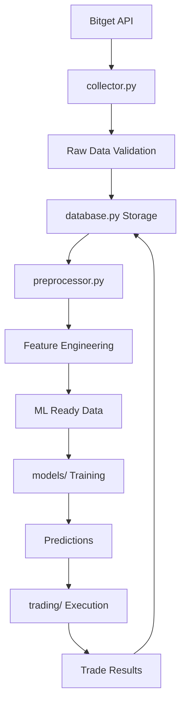

# 📁 data/ - Sistema de Gestión de Datos

> **Propósito**: Recolección, almacenamiento, procesamiento y preparación de todos los datos de mercado para el sistema de trading.

## 🎯 ORGANIZACIÓN DE ARCHIVOS

```
data/
├── __init__.py                 # Inicialización del módulo
├── database.py                 # 💾 Gestor de base de datos SQLite/PostgreSQL
├── collector.py                # 📥 Recolector de datos de Bitget (REST + WebSocket)
├── preprocessor.py             # 🔧 Feature engineering y preparación ML
├── validator.py                # ✅ Validador de calidad de datos (futuro)
├── historical_manager.py       # 📊 Gestor de datos históricos (futuro)
├── real_time_processor.py      # ⚡ Procesador en tiempo real (futuro)
├── market_scanner.py           # 🔍 Scanner de oportunidades multi-symbol (futuro)
├── raw/                        # 📁 Datos crudos temporales
├── processed/                  # 📁 Datos procesados listos para ML
├── historical/                 # 📁 Archive histórico
└── README.md                   # 📄 Esta documentación
```

## 🔧 FUNCIONALIDADES PRINCIPALES

### **1. database.py - Gestor de Base de Datos**
```python
Responsabilidades:
├── 🏗️ Crear y gestionar esquema de BD
├── 💾 Operaciones CRUD para datos de mercado
├── 📊 Gestión de trades y performance
├── 🧠 Almacenamiento de métricas ML
├── 🔄 Backup y recovery automático
├── 📈 Consultas optimizadas para análisis
└── 🧹 Limpieza de datos antiguos
```

**Clases y Funciones Principales:**
- `MarketData`: Estructura de datos OHLCV
- `TradeRecord`: Registro de trades ejecutados
- `ModelMetrics`: Métricas del modelo ML
- `DatabaseManager`: Gestor principal
- `get_market_data()`: Obtener datos históricos
- `insert_market_data()`: Insertar nuevos datos
- `get_performance_stats()`: Estadísticas de trading

### **2. collector.py - Recolector de Datos**
```python
Responsabilidades:
├── 🔌 Conexión robusta con Bitget API
├── 📊 Recolección de datos históricos
├── ⚡ Stream en tiempo real via WebSocket
├── 🔄 Manejo de reconexiones automáticas
├── 📝 Logging detallado de operaciones
├── 🎯 Callbacks para datos en tiempo real
└── 💾 Almacenamiento automático en BD
```

**Funciones Clave:**
- `fetch_historical_data()`: Descarga datos históricos
- `start_websocket_stream()`: Inicia stream en tiempo real
- `add_tick_callback()`: Registra callback para ticks
- `add_kline_callback()`: Registra callback para velas
- `health_check()`: Verifica estado de conexiones

### **3. preprocessor.py - Feature Engineering**
```python
Responsabilidades:
├── 📊 Cálculo de indicadores técnicos (50+ indicadores)
├── 🎯 Creación de features para ML
├── 🔧 Normalización y escalado de datos
├── 📈 Detección de patrones y regímenes de mercado
├── ⏰ Features temporales y estacionales
├── 🎲 Creación de variables objetivo
└── 🔄 Pipeline de preprocesamiento
```

**Clases Principales:**
- `TechnicalIndicators`: Indicadores técnicos
- `PriceActionFeatures`: Features de acción del precio
- `DataPreprocessor`: Procesador principal
- `prepare_training_data()`: Preparar datos para entrenamiento
- `prepare_prediction_data()`: Preparar datos para predicción

## 📊 ESQUEMA DE BASE DE DATOS

### **Tabla: market_data**
```sql
CREATE TABLE market_data (
    id INTEGER PRIMARY KEY,
    symbol TEXT NOT NULL,           -- Ej: BTCUSDT
    timestamp INTEGER NOT NULL,     -- Unix timestamp
    open REAL NOT NULL,            -- Precio apertura
    high REAL NOT NULL,            -- Precio máximo
    low REAL NOT NULL,             -- Precio mínimo
    close REAL NOT NULL,           -- Precio cierre
    volume REAL NOT NULL,          -- Volumen
    created_at TIMESTAMP,          -- Momento de inserción
    UNIQUE(symbol, timestamp)
);
```

### **Tabla: trades**
```sql
CREATE TABLE trades (
    id INTEGER PRIMARY KEY,
    symbol TEXT NOT NULL,
    side TEXT CHECK(side IN ('buy', 'sell')),
    entry_price REAL NOT NULL,
    exit_price REAL,
    quantity REAL NOT NULL,
    entry_time TIMESTAMP NOT NULL,
    exit_time TIMESTAMP,
    pnl REAL,                      -- Profit/Loss
    pnl_pct REAL,                  -- P&L porcentual
    confidence REAL,               -- Confianza del modelo
    model_prediction REAL,         -- Predicción del modelo
    actual_result REAL,            -- Resultado real
    fees REAL DEFAULT 0.0,
    trade_id TEXT UNIQUE,
    status TEXT DEFAULT 'open',
    stop_loss REAL,
    take_profit REAL,
    exit_reason TEXT
);
```

### **Tabla: model_metrics**
```sql
CREATE TABLE model_metrics (
    id INTEGER PRIMARY KEY,
    model_version TEXT NOT NULL,
    accuracy REAL NOT NULL,
    precision_score REAL NOT NULL,
    recall_score REAL NOT NULL,
    f1_score REAL NOT NULL,
    total_predictions INTEGER,
    correct_predictions INTEGER,
    training_time REAL,
    features_used TEXT,            -- JSON array
    hyperparameters TEXT,          -- JSON object
    created_at TIMESTAMP
);
```

## 🔄 FLUJO DE DATOS



## 📈 INDICADORES TÉCNICOS IMPLEMENTADOS

### **Tendencia**
```python
Indicadores de Tendencia:
├── 📊 SMA (5, 10, 20, 50)
├── 📈 EMA (12, 26, 50)
├── 🎯 MACD + Signal + Histogram
├── 🔀 ADX + DI+ + DI-
├── 📍 Parabolic SAR
├── 🌊 Ichimoku (Tenkan, Kijun, Senkou A/B)
└── 📏 CCI (Commodity Channel Index)
```

### **Momentum**
```python
Indicadores de Momentum:
├── ⚡ RSI (14, 21)
├── 🎪 Stochastic %K/%D
├── 📉 Williams %R
├── 🔄 ROC (Rate of Change)
├── 💪 TSI (True Strength Index)
├── 🌟 Awesome Oscillator
└── 🔑 KST (Know Sure Thing)
```

### **Volatilidad**
```python
Indicadores de Volatilidad:
├── 📏 ATR (14, 21)
├── 🎈 Bollinger Bands
├── 📊 Keltner Channels
├── 🏔️ Donchian Channels
└── 🩹 Ulcer Index
```

### **Volumen**
```python
Indicadores de Volumen:
├── 📊 OBV (On Balance Volume)
├── 💰 VWAP
├── 📈 Volume SMA/RSI
├── 🔄 A/D Line
├── 💸 Chaikin Money Flow
├── ⚡ Force Index
└── 💹 Money Flow Index
```

## 🎯 FEATURES DE MACHINE LEARNING

### **Price Action Features**
```python
Features de Precio:
├── 📈 Returns (1, 5, 10, 20 períodos)
├── 📊 Log returns
├── 🕯️ Candlestick patterns (body, shadows)
├── 📍 Price position in range
├── 🌊 Volatility rolling
├── ⚡ Price acceleration
└── 🎯 Support/Resistance levels
```

### **Market Regime Features**
```python
Features de Régimen:
├── 📊 Volatility regime (low/medium/high)
├── 📈 Trend regime (up/down/sideways)
├── 💪 Market strength (weak/moderate/strong)
├── ⏰ Time-based features (hour, day, month)
├── 🌍 Session features (Asian/European/US)
└── 🔄 Cyclical encoding
```

### **Target Variables**
```python
Variables Objetivo:
├── 🎯 Classification: [SELL, HOLD, BUY]
├── 📊 Regression: Future return
├── 🎪 Multi-target: Direction + Magnitude
└── ⚖️ Risk-adjusted returns
```

## 🚀 EXPANSIONES FUTURAS

### **validator.py - Validador de Datos**
```python
Funcionalidades Planeadas:
├── ✅ Detectar gaps en datos
├── 🔍 Identificar outliers
├── 📊 Validar consistency cross-timeframes
├── 🧹 Limpiar datos corruptos
└── 📈 Quality scoring
```

### **historical_manager.py - Gestor Histórico**
```python
Funcionalidades Planeadas:
├── 📥 Descarga masiva de datos históricos
├── 💾 Compresión y archiving
├── 🔄 Sincronización multi-exchange
├── 📊 Data lineage tracking
└── 🎯 Smart sampling para training
```

### **market_scanner.py - Scanner Multi-Symbol**
```python
Funcionalidades Planeadas:
├── 🔍 Scan de oportunidades en tiempo real
├── 📊 Ranking de símbolos por potencial
├── 🎯 Detección de breakouts
├── 📈 Momentum scanning
└── 🚨 Alert generation
```

## 🛠️ GUÍAS DE USO

### **Para Desarrolladores (Cursor/Claude)**

#### **Recolectar datos históricos:**
```python
from data.collector import collect_and_save_historical_data

# Recolectar 30 días de BTCUSDT
saved_count = await collect_and_save_historical_data(
    symbol="BTCUSDT",
    timeframe="1h", 
    days_back=30
)
```

#### **Preparar datos para ML:**
```python
from data.preprocessor import data_preprocessor

# Preparar datos de entrenamiento
X, y, df = data_preprocessor.prepare_training_data(
    symbol="BTCUSDT",
    days_back=100,
    target_method="classification"
)
```

#### **Consultar base de datos:**
```python
from data.database import db_manager

# Obtener datos de mercado
df = db_manager.get_market_data(
    symbol="BTCUSDT",
    start_date=datetime.now() - timedelta(days=7)
)

# Obtener estadísticas de performance
stats = db_manager.get_performance_stats(days=30)
```

### **Monitoreo de Calidad de Datos**

#### **Health checks:**
```python
# Verificar estado del collector
health = await data_collector.health_check()

# Verificar estadísticas de BD
stats = db_manager.get_database_stats()

# Verificar freshness de datos
latest = db_manager.get_latest_market_data("BTCUSDT", 1)
```

## 🔧 CONFIGURACIONES IMPORTANTES

### **Configuración en user_settings.yaml:**
```yaml
data_settings:
  collection:
    timeframes: ["1m", "5m", "15m", "1h", "4h"]
    symbols: ["BTCUSDT", "ETHUSDT", "ADAUSDT"]
    max_history_days: 365
    
  preprocessing:
    lookback_window: 60
    feature_importance:
      price_action: 0.3
      technical_indicators: 0.4
      volume_analysis: 0.2
      market_sentiment: 0.1
```

## 🛡️ GESTIÓN DE ERRORES

```python
Error Handling:
├── 🔌 API disconnections → Auto-reconnect
├── 📊 Missing data → Fill strategies
├── 💾 Database locks → Retry logic
├── 🧮 Calculation errors → Fallback values
├── 🔍 Invalid data → Validation & cleanup
└── 💥 Critical errors → Graceful shutdown
```

---

**📝 Nota para Cursor**: Este módulo es crítico para la calidad del trading. Siempre validar datos antes de usar en ML. La calidad de los datos determina la calidad de las predicciones.