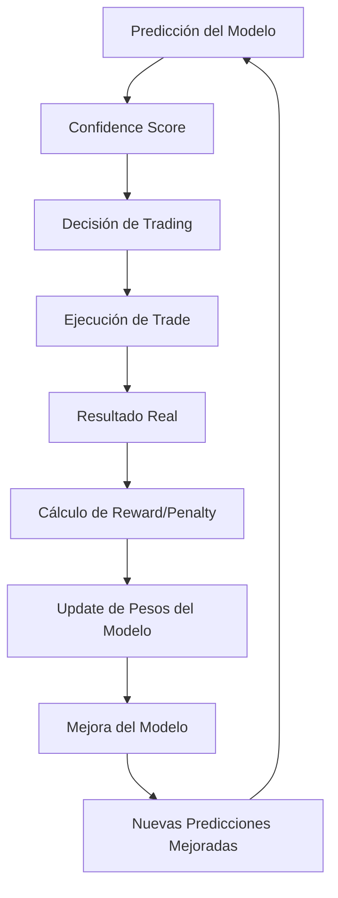

# 📁 models/ - Sistema de Machine Learning

> **Propósito**: Cerebro inteligente del bot con redes neuronales autoadaptables para predicción de movimientos de mercado y optimización continua.

## 🎯 ORGANIZACIÓN DE ARCHIVOS

```
models/
├── __init__.py                    # Inicialización del módulo
├── neural_network.py              # 🧠 Red neuronal principal (LSTM + Transformer)
├── adaptive_trainer.py            # 🎓 Sistema de entrenamiento continuo
├── multi_symbol_manager.py        # 🎪 Gestor multi-symbol con transfer learning
├── feature_selector.py            # 🎯 Selector automático de features
├── ensemble_manager.py            # 🎭 Ensemble de múltiples modelos
├── model_evaluator.py             # 📊 Evaluador de performance de modelos
├── prediction_engine.py           # ⚡ Motor de predicciones en tiempo real
├── hyperparameter_optimizer.py    # 🔧 Optimizador automático de hiperparámetros
├── model_versioning.py            # 📚 Control de versiones de modelos
├── transfer_learning.py           # 🔄 Transfer learning entre símbolos
├── reward_system.py               # 🎁 Sistema de recompensas/penalizaciones
├── confidence_estimator.py        # 💪 Estimador de confianza
├── market_regime_detector.py      # 🌊 Detector de regímenes de mercado
├── saved_models/                  # 💾 Modelos entrenados guardados
│   ├── BTCUSDT/                  # 📁 Modelos específicos por símbolo
│   │   ├── current_model.h5      # Modelo activo
│   │   ├── backup_model.h5       # Modelo backup
│   │   └── versions/             # Versiones históricas
│   ├── ETHUSDT/                  # 📁 
│   ├── ensemble/                 # 📁 Modelos ensemble
│   └── base_models/              # 📁 Modelos base para transfer learning
├── experiments/                   # 🧪 Experimentos y A/B testing
├── checkpoints/                   # 🔄 Checkpoints de entrenamiento
├── scalers/                      # 📏 Scalers guardados
└── README.md                      # 📄 Esta documentación
```

## 🧠 ARQUITECTURA DE RED NEURONAL

### **Diseño Híbrido Innovador**
```python
Arquitectura Multi-Layer:
├── 📊 Input Layer: [Batch, Sequence, Features]
│   └── Shape: (None, 60, 150+)  # 60 timesteps, 150+ features
├── 🧠 Feature Extraction Block:
│   ├── LSTM Layer 1: 128 units + Dropout(0.2)
│   ├── LSTM Layer 2: 64 units + Dropout(0.2)
│   └── LSTM Layer 3: 32 units + Dropout(0.2)
├── 🎯 Attention Mechanism:
│   ├── Multi-Head Attention: 8 heads
│   ├── Position Encoding: Temporal awareness
│   └── Attention Weights: Feature importance
├── 🔍 Market Regime Detection:
│   ├── Regime Classifier: Bull/Bear/Sideways
│   ├── Volatility Estimator: High/Medium/Low
│   └── Trend Strength: Strong/Weak
├── 🎭 Ensemble Decision Layer:
│   ├── Dense Layer 1: 64 units + ReLU
│   ├── Dense Layer 2: 32 units + ReLU
│   ├── Dense Layer 3: 16 units + ReLU
│   └── Dropout: 0.3
├── ⚡ Confidence Estimation:
│   ├── Confidence Head: Sigmoid activation
│   ├── Uncertainty Quantification: Bayesian dropout
│   └── Calibration Layer: Temperature scaling
└── 📈 Output Layer:
    ├── Action Probabilities: [P(SELL), P(HOLD), P(BUY)]
    ├── Confidence Score: 0.0 - 1.0
    ├── Expected Return: -1.0 to 1.0
    └── Position Size Suggestion: 0.0 - 1.0
```

### **Especificaciones Técnicas Detalladas**
```python
Model Architecture:
├── Total Parameters: ~2.5M (optimizado para velocidad)
├── Input Features: 150+ (dinámico)
├── Sequence Length: 60 timesteps (1 hora de datos por minuto)
├── Output Classes: 3 [SELL=0, HOLD=1, BUY=2]
├── Loss Function: Custom Profit-Aware Loss
├── Optimizer: AdamW con weight decay
├── Learning Rate: 0.001 con scheduler
├── Batch Size: 64 (ajustable según GPU)
├── Regularization: L2 + Dropout + Early Stopping
└── Activation Functions: ReLU, Softmax, Sigmoid
```

## 🔧 FUNCIONALIDADES PRINCIPALES

### **1. neural_network.py - Red Neuronal Principal**
```python
Responsabilidades:
├── 🏗️ Definir arquitectura híbrida LSTM+Transformer
├── 🎯 Implementar forward pass optimizado
├── 🧮 Calcular predicciones con confidence scores
├── 💾 Save/Load de modelos con versionado
├── 📊 Batch processing para eficiencia
├── 🔄 Online learning capabilities
├── 🎭 Ensemble prediction methods
└── 🛡️ Error handling robusto
```

**Clases Principales:**
```python
class TradingNeuralNetwork:
    def __init__(self, config):
        """Inicializa la red neuronal"""
    
    def build_model(self):
        """Construye la arquitectura del modelo"""
    
    def predict(self, features):
        """Realiza predicciones con confidence"""
    
    def train_step(self, X, y):
        """Un paso de entrenamiento"""
    
    def evaluate(self, X_test, y_test):
        """Evalúa el modelo"""
    
    def save_model(self, path):
        """Guarda el modelo entrenado"""
    
    def load_model(self, path):
        """Carga modelo desde archivo"""
```

### **2. adaptive_trainer.py - Entrenamiento Continuo**
```python
Responsabilidades:
├── 🎓 Entrenamiento inicial con datos históricos
├── 🔄 Online learning con nuevos datos de trades
├── 📊 Performance monitoring en tiempo real
├── 🎯 Auto-reentrenamiento basado en resultados
├── 🧪 A/B testing de diferentes versiones
├── 💾 Checkpoint management automático
├── 🚨 Early stopping inteligente
└── 📈 Learning curve analysis
```

**Funciones Clave:**
```python
class AdaptiveTrainer:
    def train_initial_model(self, symbol, days_back):
        """Entrenamiento inicial con datos históricos"""
    
    def online_learning_update(self, new_data, trade_results):
        """Actualización continua con nuevos datos"""
    
    def evaluate_and_retrain(self):
        """Evalúa performance y decide si reentrenar"""
    
    def performance_tracking(self):
        """Monitorea métricas de performance"""
    
    def should_retrain(self):
        """Decide si es necesario reentrenar"""
```

### **3. multi_symbol_manager.py - Gestor Multi-Symbol**
```python
Responsabilidades:
├── 🎪 Orquestación de modelos para múltiples símbolos
├── 🔄 Transfer learning entre símbolos correlacionados
├── 📊 Análisis de correlaciones en tiempo real
├── ⚖️ Balanceo de recursos computacionales
├── 🎯 Priorización de símbolos por oportunidad
├── 📈 Portfolio optimization basada en predicciones ML
├── 🚨 Gestión de conflictos entre señales
└── 🔄 Dynamic model allocation
```

**Arquitectura Multi-Symbol:**
```python
class MultiSymbolManager:
    def __init__(self):
        self.symbol_models = {}      # Modelos por símbolo
        self.shared_encoder = None   # Encoder compartido
        self.correlation_matrix = {} # Matriz de correlaciones
        self.resource_allocator = ResourceAllocator()
    
    def add_symbol(self, symbol):
        """Añade nuevo símbolo al sistema"""
    
    def transfer_learning(self, source_symbol, target_symbol):
        """Aplica transfer learning entre símbolos"""
    
    def predict_all_symbols(self):
        """Predicciones para todos los símbolos activos"""
    
    def optimize_portfolio(self, predictions):
        """Optimiza asignación de capital basada en predicciones"""
```

### **4. ensemble_manager.py - Sistema de Ensemble**
```python
Responsabilidades:
├── 🎭 Gestión de múltiples modelos especializados
├── 📊 Voting system inteligente
├── 🎯 Model selection basado en condiciones de mercado
├── 📈 Performance tracking por modelo
├── 🔄 Dynamic weighting de modelos
├── 🧪 A/B testing de combinaciones
└── 🛡️ Fallback mechanisms
```

**Modelos Especializados:**
```python
Ensemble Components:
├── 🎯 TrendFollowingModel: Especializado en tendencias largas
├── 📊 MeanReversionModel: Especializado en reversiones
├── ⚡ MomentumModel: Especializado en momentum corto plazo
├── 🌊 VolatilityModel: Especializado en cambios de volatilidad
├── 📈 VolumeModel: Especializado en análisis de volumen
├── 🎪 NewsModel: Especializado en eventos de noticias (futuro)
└── 🧠 MetaModel: Combina todas las predicciones
```

## 🔄 SISTEMA DE APRENDIZAJE CONTINUO

### **Feedback Loop Inteligente**


### **Sistema de Recompensas/Penalizaciones**
```python
class RewardSystem:
    """Sistema de recompensas para aprendizaje continuo"""
    
    def calculate_reward(self, prediction, actual_result, trade_duration):
        """Calcula reward basado en resultado del trade"""
        
        rewards = {
            'profitable_trade': 1.0,      # Trade ganador base
            'high_profit_bonus': 2.0,     # Bonus si ganancia > 5%
            'quick_profit_bonus': 0.5,    # Bonus si ganancia < 1h
            'low_risk_bonus': 0.3,        # Bonus si riesgo bajo
            'consistency_bonus': 0.5,     # Bonus por consistencia
            'volatility_adaptation': 0.3   # Bonus por adaptarse a volatilidad
        }
        
        penalties = {
            'losing_trade': -0.5,         # Trade perdedor
            'big_loss_penalty': -2.0,     # Penalización si pérdida > 3%
            'missed_opportunity': -0.1,   # Penalización leve por no operar
            'early_stop_penalty': -0.2,   # Penalización por salir temprano
            'overconfidence_penalty': -1.0 # Penalización por overconfidence
        }
```

### **Métricas de Aprendizaje**
```python
Learning Metrics:
├── 📊 Prediction Accuracy: % predicciones correctas por período
├── 💰 Profit-Weighted Accuracy: Accuracy ponderada por profit
├── 🎯 Sharpe Ratio: Retorno ajustado por riesgo
├── 📈 Information Ratio: Alpha generado por el modelo
├── ⚡ Reaction Speed: Velocidad de adaptación a cambios
├── 🔄 Learning Rate: Velocidad de mejora del modelo
├── 🧠 Confidence Calibration: Precisión de confidence scores
└── 🎪 Market Regime Adaptation: Adaptación a diferentes mercados
```

## 🎯 FEATURES Y PREDICCIONES

### **Input Features Detalladas (150+ features)**
```python
Feature Categories:
├── 📊 OHLCV Features (5):
│   ├── Open, High, Low, Close, Volume
│   └── Normalized by rolling statistics
├── 📈 Technical Indicators (50+):
│   ├── Trend: SMA, EMA, MACD, ADX, Parabolic SAR
│   ├── Momentum: RSI, Stochastic, Williams %R, ROC
│   ├── Volatility: Bollinger Bands, ATR, Keltner Channels
│   ├── Volume: OBV, VWAP, Chaikin Money Flow, Force Index
│   └── Oscillators: CCI, TSI, Awesome Oscillator
├── 🎪 Price Action Features (20+):
│   ├── Returns: 1, 5, 10, 20 período returns
│   ├── Volatility: Rolling std, GARCH estimates
│   ├── Patterns: Candlestick body/shadow ratios
│   ├── Support/Resistance: Distance to key levels
│   └── Trend Analysis: Trend strength, slope
├── ⏰ Temporal Features (15+):
│   ├── Time-based: Hour, day, month, quarter
│   ├── Cyclical: Sin/cos encoding of time features
│   ├── Sessions: Asian/European/US market sessions
│   ├── Calendar: Weekends, holidays, month-end
│   └── Seasonality: Monthly/quarterly patterns
├── 🌊 Market Regime Features (20+):
│   ├── Volatility Regime: Low/Medium/High vol periods
│   ├── Trend Regime: Bull/Bear/Sideways markets
│   ├── Momentum Regime: Strong/Weak momentum
│   ├── Volume Regime: High/Normal/Low volume
│   └── Market Stress: Fear/Greed indicators
├── 🔄 Cross-Symbol Features (30+):
│   ├── Correlation Signals: Signals from correlated assets
│   ├── Relative Performance: Performance vs other symbols
│   ├── Divergence Signals: Divergences between symbols
│   ├── Market Leadership: Leading/lagging indicators
│   └── Sector Rotation: Rotation between asset classes
└── 📊 Meta Features (20+):
    ├── Feature Interactions: Polynomial and interaction terms
    ├── Statistical Moments: Skewness, kurtosis
    ├── Information Theory: Entropy, mutual information
    ├── Wavelet Features: Multi-scale analysis
    └── Fractal Features: Hurst exponent, fractal dimension
```

### **Output Predictions Detalladas**
```python
Prediction Output Structure:
├── 🎯 Action Probabilities:
│   ├── P(SELL): 0.0 - 1.0
│   ├── P(HOLD): 0.0 - 1.0
│   └── P(BUY): 0.0 - 1.0 (sum = 1.0)
├── 💪 Confidence Metrics:
│   ├── Overall Confidence: 0.0 - 1.0
│   ├── Uncertainty Estimate: Bayesian uncertainty
│   ├── Entropy: Prediction entropy
│   └── Calibrated Confidence: Temperature-scaled
├── 📊 Expected Outcomes:
│   ├── Expected Return: -1.0 to 1.0
│   ├── Expected Volatility: Volatility forecast
│   ├── Time Horizon: Expected trade duration
│   └── Risk Assessment: Risk level 1-5
├── 🎪 Position Sizing:
│   ├── Optimal Size: Kelly criterion based
│   ├── Risk-Adjusted Size: Volatility adjusted
│   ├── Confidence-Adjusted: Based on confidence
│   └── Portfolio Context: Considering other positions
├── 📈 Market Context:
│   ├── Market Regime: Bull/Bear/Sideways
│   ├── Volatility Forecast: Expected volatility
│   ├── Trend Strength: 0.0 - 1.0
│   └── Market Stress Level: 0.0 - 1.0
└── 🔍 Explainability:
    ├── Feature Importance: Top contributing features
    ├── Attention Weights: What the model focuses on
    ├── Similar Patterns: Historical similar situations
    └── Decision Rationale: Human-readable explanation
```

## 🔧 CONFIGURACIONES DE MODELO

### **Arquitectura Configuration**
```yaml
model_architecture:
  lstm_config:
    units: [128, 64, 32]          # LSTM layer sizes
    dropout_rate: 0.2             # Dropout para regularización
    recurrent_dropout: 0.1        # Recurrent dropout
    return_sequences: [true, true, false]  # Return sequences config
    
  attention_config:
    num_heads: 8                  # Multi-head attention heads
    key_dim: 64                   # Attention key dimension
    dropout_rate: 0.1             # Attention dropout
    
  dense_config:
    units: [64, 32, 16]          # Dense layer sizes
    dropout_rate: 0.3             # Dense dropout
    activation: 'relu'            # Activation function
    
  output_config:
    num_classes: 3                # SELL, HOLD, BUY
    confidence_head: true         # Include confidence estimation
    return_head: true             # Include return prediction
    sizing_head: true             # Include position sizing
```

### **Training Configuration**
```yaml
training_config:
  initial_training:
    epochs: 100                   # Maximum epochs
    batch_size: 64               # Batch size
    learning_rate: 0.001         # Initial learning rate
    validation_split: 0.2        # Validation percentage
    early_stopping_patience: 15  # Early stopping patience
    
  online_learning:
    update_frequency: 50          # Update every N trades
    learning_rate_decay: 0.95    # LR decay for online learning
    min_samples_retrain: 100     # Minimum samples for retraining
    performance_threshold: 0.6   # Accuracy threshold for retraining
    
  optimization:
    optimizer: 'adamw'           # Optimizer type
    weight_decay: 0.01           # L2 regularization
    gradient_clipping: 1.0       # Gradient clipping value
    mixed_precision: true        # Use mixed precision training
```

### **Multi-Symbol Configuration**
```yaml
multi_symbol_config:
  transfer_learning:
    enabled: true                # Enable transfer learning
    shared_encoder: true         # Share encoder between symbols
    fine_tune_epochs: 20         # Fine-tuning epochs for new symbols
    
  resource_allocation:
    BTCUSDT: 0.30               # 30% computational resources
    ETHUSDT: 0.25               # 25% computational resources
    ADAUSDT: 0.15               # 15% computational resources
    SOLUSDT: 0.10               # 10% computational resources
    MATICUSDT: 0.10             # 10% computational resources
    DOTUSDT: 0.10               # 10% computational resources
    
  correlation_config:
    correlation_threshold: 0.7   # Threshold for correlation-based features
    update_frequency: 24         # Update correlations every 24h
    lookback_periods: 720        # 720h (30 days) for correlation calculation
```

## 🚀 ALGORITMOS AVANZADOS

### **Transfer Learning Strategy**
```python
class TransferLearning:
    """Implementa transfer learning entre símbolos"""
    
    def __init__(self):
        self.base_model = None       # Modelo base pre-entrenado
        self.symbol_heads = {}       # Cabezas específicas por símbolo
        
    def pretrain_base_model(self, symbol="BTCUSDT"):
        """Pre-entrena modelo base con el símbolo principal"""
        
    def transfer_to_new_symbol(self, new_symbol):
        """Transfiere conocimiento a nuevo símbolo"""
        # 1. Freeze base layers
        # 2. Add new symbol-specific head
        # 3. Fine-tune on new symbol data
        # 4. Gradually unfreeze layers
        
    def continual_learning(self):
        """Aprendizaje continuo sin forgetting"""
        # 1. Elastic Weight Consolidation (EWC)
        # 2. Progressive Neural Networks
        # 3. Knowledge Distillation
```

### **Hyperparameter Optimization**
```python
class HyperparameterOptimizer:
    """Optimización automática de hiperparámetros"""
    
    def __init__(self):
        self.search_space = {
            'lstm_units': [(64, 32, 16), (128, 64, 32), (256, 128, 64)],
            'dropout_rate': [0.1, 0.2, 0.3, 0.4],
            'learning_rate': [0.0001, 0.001, 0.01],
            'batch_size': [32, 64, 128],
            'attention_heads': [4, 8, 16]
        }
        
    def bayesian_optimization(self):
        """Optimización Bayesiana de hiperparámetros"""
        
    def random_search(self):
        """Búsqueda aleatoria de hiperparámetros"""
        
    def grid_search(self):
        """Búsqueda en grilla de hiperparámetros"""
```

### **Advanced ML Techniques**
```python
Advanced Techniques:
├── 🎭 Adversarial Training:
│   ├── Genera ejemplos adversariales para robustez
│   ├── Mejora generalización ante ruido de mercado
│   └── Previene overfitting a patrones específicos
├── 🔄 Curriculum Learning:
│   ├── Entrena primero en datos fáciles
│   ├── Progresivamente aumenta dificultad
│   └── Mejora convergencia y estabilidad
├── 🎯 Meta-Learning:
│   ├── Aprende a aprender rápidamente
│   ├── Adaptación rápida a nuevos mercados
│   └── Few-shot learning para nuevos símbolos
├── 📊 Self-Supervised Learning:
│   ├── Aprende representaciones sin labels
│   ├── Masked language modeling para series temporales
│   └── Contrastive learning para similitudes
├── 🧠 Graph Neural Networks:
│   ├── Modela relaciones entre activos
│   ├── Captura dependencias complejas
│   └── Propagación de información entre nodos
└── 🌊 Variational Autoencoders:
    ├── Compresión inteligente de features
    ├── Generación de escenarios sintéticos
    └── Detección de anomalías de mercado
```

## 📊 EVALUACIÓN Y MÉTRICAS

### **Métricas Financieras**
```python
Financial Metrics:
├── 📊 Return Metrics:
│   ├── Total Return: Retorno total del período
│   ├── Annualized Return: Retorno anualizado
│   ├── Excess Return: Retorno sobre benchmark
│   └── Risk-Adjusted Return: Retorno ajustado por riesgo
├── 🎯 Risk Metrics:
│   ├── Sharpe Ratio: Return/Risk ratio
│   ├── Sortino Ratio: Downside risk adjusted
│   ├── Calmar Ratio: Return/Max Drawdown
│   ├── Maximum Drawdown: Pérdida máxima
│   ├── VaR (Value at Risk): Pérdida esperada
│   └── Expected Shortfall: Tail risk measure
├── 📈 Trading Metrics:
│   ├── Win Rate: % trades ganadores
│   ├── Profit Factor: Gross profit/Gross loss
│   ├── Average Win/Loss: Promedio ganancias/pérdidas
│   ├── Trade Duration: Duración promedio trades
│   ├── Turnover: Frecuencia de trading
│   └── Hit Rate: % predicciones correctas
└── 🔄 Consistency Metrics:
    ├── Information Ratio: Excess return/Tracking error
    ├── Stability: Consistencia de returns
    ├── Skewness: Asimetría de returns
    └── Kurtosis: Fat tails en distribución
```

### **Métricas de Machine Learning**
```python
ML Performance Metrics:
├── 📊 Classification Metrics:
│   ├── Accuracy: % predicciones correctas
│   ├── Precision: True positives/(True positives + False positives)
│   ├── Recall: True positives/(True positives + False negatives)
│   ├── F1-Score: Harmonic mean of precision and recall
│   ├── AUC-ROC: Area under ROC curve
│   ├── AUC-PR: Area under Precision-Recall curve
│   └── Cohen's Kappa: Agreement accounting for chance
├── 🎯 Confidence Metrics:
│   ├── Confidence Calibration: Calibración de confidence scores
│   ├── Brier Score: Probability forecast accuracy
│   ├── Log Loss: Logarithmic loss
│   └── Expected Calibration Error: ECE
├── 📈 Feature Metrics:
│   ├── Feature Importance: Importancia de cada feature
│   ├── Permutation Importance: Importance por permutación
│   ├── SHAP Values: Shapley values para explainability
│   └── Feature Stability: Estabilidad temporal de features
└── 🔄 Model Metrics:
    ├── Training Time: Tiempo de entrenamiento
    ├── Inference Time: Tiempo de predicción
    ├── Memory Usage: Uso de memoria
    ├── Model Size: Tamaño del modelo
    └── Convergence Speed: Velocidad de convergencia
```

## 🛠️ GUÍAS DE USO

### **Para Desarrolladores (Cursor/Claude)**

#### **Entrenar modelo inicial:**
```python
from models.neural_network import TradingNeuralNetwork
from models.adaptive_trainer import AdaptiveTrainer
from data.preprocessor import data_preprocessor

# Preparar datos
X, y, df = data_preprocessor.prepare_training_data(
    symbol="BTCUSDT",
    days_back=365,
    target_method="classification"
)

# Crear y entrenar modelo
model = TradingNeuralNetwork()
trainer = AdaptiveTrainer(model)

# Entrenamiento inicial
history = trainer.train_initial_model(
    X_train=X,
    y_train=y,
    symbol="BTCUSDT"
)

print(f"Training completed. Final accuracy: {history.history['accuracy'][-1]:.3f}")
```

#### **Hacer predicciones en tiempo real:**
```python
from models.prediction_engine import PredictionEngine
from data.collector import data_collector

# Motor de predicciones
predictor = PredictionEngine()

# Obtener datos actuales
current_data = await data_collector.get_current_market_data("BTCUSDT")

# Procesar features
features = data_preprocessor.prepare_prediction_data(current_data)

# Obtener predicción
prediction = predictor.predict(
    symbol="BTCUSDT",
    features=features
)

print(f"Prediction: {prediction}")
# Output example:
# {
#   'action': 'BUY',
#   'probabilities': [0.15, 0.25, 0.60],  # [SELL, HOLD, BUY]
#   'confidence': 0.85,
#   'expected_return': 0.03,
#   'suggested_size': 0.02,
#   'time_horizon': 4.5,  # hours
#   'risk_level': 2,  # 1-5 scale
#   'market_regime': 'bull'
# }
```

#### **Gestión multi-symbol:**
```python
from models.multi_symbol_manager import MultiSymbolManager

# Crear gestor multi-symbol
manager = MultiSymbolManager()

# Agregar símbolos
symbols = ["BTCUSDT", "ETHUSDT", "ADAUSDT", "SOLUSDT"]
for symbol in symbols:
    manager.add_symbol(symbol)

# Entrenar con transfer learning
manager.train_all_symbols(
    base_symbol="BTCUSDT",  # Símbolo base para transfer learning
    days_back=365
)

# Predicciones para todos los símbolos
predictions = manager.predict_all_symbols()

for symbol, pred in predictions.items():
    print(f"{symbol}: {pred['action']} (confidence: {pred['confidence']:.2f})")
```

#### **Sistema de recompensas:**
```python
from models.reward_system import RewardSystem
from models.adaptive_trainer import AdaptiveTrainer

# Sistema de recompensas
reward_system = RewardSystem()

# Simular resultado de trade
trade_result = {
    'symbol': 'BTCUSDT',
    'action': 'BUY',
    'entry_price': 45000,
    'exit_price': 46350,  # +3% ganancia
    'confidence': 0.85,
    'duration_hours': 2.5,
    'expected_return': 0.03
}

# Calcular reward
reward = reward_system.calculate_reward(trade_result)
print(f"Reward: {reward:.2f}")

# Aplicar reward al modelo para aprendizaje continuo
trainer = AdaptiveTrainer()
trainer.apply_reward_feedback(trade_result, reward)
```

### **Configuración en user_settings.yaml:**
```yaml
ai_model_settings:
  architecture:
    model_type: "lstm_transformer"
    lstm_units: [128, 64, 32]
    dense_units: [64, 32, 16]
    dropout_rate: 0.2
    attention_heads: 8
    
  training:
    initial_epochs: 100
    batch_size: 64
    learning_rate: 0.001
    validation_split: 0.2
    early_stopping_patience: 15
    
  online_learning:
    enabled: true
    update_frequency: 50        # Cada 50 trades
    min_accuracy_threshold: 0.6 # Reentrenar si accuracy < 60%
    learning_rate_decay: 0.95
    
  confidence:
    min_confidence_to_trade: 65.0    # Mínimo 65% confianza
    high_confidence_threshold: 80.0  # 80%+ alta confianza
    confidence_adjustments:
      low_confidence: 0.5       # Reducir size si baja confianza
      high_confidence: 1.5      # Aumentar size si alta confianza
      
  ensemble:
    enabled: true
    models: ["trend", "momentum", "mean_reversion", "volatility"]
    voting_method: "confidence_weighted"
    
  multi_symbol:
    enabled: false              # Por ahora solo BTCUSDT
    transfer_learning: true
    shared_encoder: true
    max_symbols: 6
```

## 🔮 EXPANSIONES FUTURAS

### **Planned Enhancements**
```python
Future Developments:
├── 🌍 Multi-Asset Support:
│   ├── Stocks: Integración con APIs de acciones
│   ├── Forex: Pares de divisas principales
│   ├── Commodities: Oro, petróleo, metales
│   ├── Indices: S&P500, NASDAQ, etc.
│   └── Options: Análisis de opciones y volatilidad implícita
├── 📰 Alternative Data:
│   ├── News Sentiment: NLP para análisis de noticias
│   ├── Social Media: Twitter, Reddit sentiment analysis
│   ├── Google Trends: Búsquedas relacionadas con crypto
│   ├── On-chain Metrics: Métricas de blockchain
│   └── Economic Indicators: Datos macroeconómicos
├── 🔍 Advanced Analytics:
│   ├── Market Microstructure: Order book analysis
│   ├── Options Flow: Flujos de opciones para sentiment
│   ├── Institutional Flow: Movimientos institucionales
│   ├── Cross-Market Arbitrage: Arbitraje entre exchanges
│   └── Regime Change Detection: ML para cambios de régimen
├── 🤖 Next-Gen AI:
│   ├── GPT Integration: LLMs para market analysis
│   ├── Reinforcement Learning: RL para strategy optimization
│   ├── Quantum Computing: Algoritmos cuánticos
│   ├── Federated Learning: Aprendizaje distribuido
│   └── Explainable AI: Interpretabilidad avanzada
└── 🌊 Advanced Techniques:
    ├── Physics-Informed Networks: Constraints de física/economía
    ├── Causal Inference: Inferencia causal en mercados
    ├── Time Series Transformers: Transformers para series temporales
    ├── Graph Attention Networks: Atención en grafos de activos
    └── Neural ODEs: Ecuaciones diferenciales neuronales
```

### **Research Areas**
```python
Cutting-Edge Research:
├── 🧬 Evolutionary Strategies:
│   ├── Genetic Programming para evolución de features
│   ├── NEAT (NeuroEvolution) para arquitecturas
│   ├── Population-based training
│   └── Multi-objective optimization
├── 🎲 Bayesian Deep Learning:
│   ├── Uncertainty quantification precisa
│   ├── Bayesian Neural Networks
│   ├── Variational Inference
│   └── Monte Carlo Dropout
├── 🌊 Advanced Time Series:
│   ├── Temporal Fusion Transformers
│   ├── N-BEATS para forecasting
│   ├── WaveNet para series temporales
│   └── Informer para series largas
├── 🔄 Continual Learning:
│   ├── Elastic Weight Consolidation
│   ├── Progressive Neural Networks
│   ├── Memory-based continual learning
│   └── Meta-learning for fast adaptation
├── 🎭 Multi-Task Learning:
│   ├── Shared representations entre tareas
│   ├── Task-specific heads
│   ├── Cross-task knowledge transfer
│   └── Hierarchical multi-task learning
└── 🚀 Emerging Paradigms:
    ├── Foundation Models para finanzas
    ├── Self-supervised learning masivo
    ├── In-context learning
    ├── Chain-of-thought reasoning
    └── Tool-using AI agents
```

## 🛡️ GESTIÓN DE RIESGOS DEL MODELO

### **Model Risk Management**
```python
Risk Controls:
├── 🎯 Prediction Validation:
│   ├── Confidence thresholds: No trade si < 65% confianza
│   ├── Consensus checking: Validar con ensemble
│   ├── Sanity checks: Validar predicciones contra reglas básicas
│   └── Outlier detection: Detectar predicciones anómalas
├── 📊 Performance Monitoring:
│   ├── Real-time accuracy tracking
│   ├── Drift detection: Cambios en distribución de datos
│   ├── Performance decay alerts
│   └── Model degradation monitoring
├── 🔄 Model Governance:
│   ├── Version control riguroso
│   ├── A/B testing de modelos
│   ├── Rollback procedures automáticos
│   ├── Champion/challenger framework
│   └── Model documentation completa
├── ⏰ Temporal Controls:
│   ├── Trading time limits: Máximo X trades por hora
│   ├── Cool-down periods: Pausa tras pérdidas
│   ├── Market condition filters: Parar en alta volatilidad
│   └── Emergency shutdown triggers
└── 💰 Financial Controls:
    ├── Position size limits: Máximo % por predicción
    ├── Capital allocation limits: % máximo del portfolio
    ├── Drawdown triggers: Stop automático en drawdown
    ├── Correlation limits: Evitar sobreexposición
    └── Stress testing regular
```

### **Error Handling & Recovery**
```python
Error Recovery Strategies:
├── 🔌 Model Loading Failures:
│   ├── Automatic fallback to backup model
│   ├── Model integrity verification
│   ├── Graceful degradation to simpler models
│   └── Alert system activation
├── 🧮 Prediction Errors:
│   ├── Input validation checks
│   ├── Output sanity checks
│   ├── Fallback to rule-based systems
│   └── Error logging and analysis
├── 💾 Memory/Performance Issues:
│   ├── Model quantization for efficiency
│   ├── Batch size reduction
│   ├── Feature selection optimization
│   └── Garbage collection optimization
├── ⚡ Training Failures:
│   ├── Checkpoint recovery
│   ├── Learning rate adjustment
│   ├── Data quality checks
│   └── Model architecture simplification
├── 🚨 Performance Degradation:
│   ├── Automatic retraining triggers
│   ├── Feature importance re-evaluation
│   ├── Hyperparameter re-optimization
│   └── Architecture search activation
└── 💥 Critical System Errors:
    ├── Emergency trading shutdown
    ├── Model state preservation
    ├── Error reporting and alerts
    ├── Manual intervention protocols
    └── System recovery procedures
```

## 🔧 OPTIMIZACIÓN DE PERFORMANCE

### **Computational Efficiency**
```python
Performance Optimizations:
├── ⚡ GPU Acceleration:
│   ├── CUDA optimization para entrenamiento
│   ├── TensorRT para inference
│   ├── Mixed precision training (FP16)
│   ├── Gradient accumulation
│   └── Multi-GPU distributed training
├── 📊 Model Optimization:
│   ├── Model quantization (INT8)
│   ├── Knowledge distillation
│   ├── Pruning de conexiones innecesarias
│   ├── Layer fusion optimization
│   └── Dynamic batching
├── 💾 Memory Optimization:
│   ├── Gradient checkpointing
│   ├── Model sharding
│   ├── Data streaming
│   ├── Memory mapping
│   └── Efficient data loaders
├── 🔄 Caching Strategies:
│   ├── Feature caching inteligente
│   ├── Prediction caching
│   ├── Model weight caching
│   ├── Data preprocessing caching
│   └── Result memoization
├── 📈 Parallel Processing:
│   ├── Multi-threading para preprocessing
│   ├── Async prediction pipelines
│   ├── Parallel feature computation
│   ├── Distributed inference
│   └── Pipeline parallelism
└── 🎯 Algorithm Optimization:
    ├── Efficient attention mechanisms
    ├── Sparse operations
    ├── Fast approximation algorithms
    ├── Early stopping optimizations
    └── Adaptive computation
```

### **Scalability Architecture**
```python
Scalability Design:
├── 🌐 Distributed Training:
│   ├── Data parallelism across GPUs
│   ├── Model parallelism para modelos grandes
│   ├── Pipeline parallelism
│   ├── Federated learning setup
│   └── Elastic training capabilities
├── 📊 Model Serving:
│   ├── Model serving infrastructure (TensorFlow Serving)
│   ├── Load balancing para predicciones
│   ├── Auto-scaling basado en demanda
│   ├── Edge deployment capabilities
│   └── A/B testing infrastructure
├── 💾 Data Management:
│   ├── Distributed data storage
│   ├── Data versioning y lineage
│   ├── Incremental data processing
│   ├── Real-time streaming pipelines
│   └── Data quality monitoring
├── 🔄 MLOps Pipeline:
│   ├── Automated model training pipelines
│   ├── Continuous integration/deployment
│   ├── Model monitoring y alerting
│   ├── Automated rollback procedures
│   └── Performance tracking dashboards
└── ⚡ Infrastructure:
    ├── Kubernetes deployment
    ├── Container orchestration
    ├── Resource management
    ├── High availability setup
    └── Disaster recovery procedures
```

## 📚 DOCUMENTACIÓN Y TESTING

### **Testing Strategy**
```python
Comprehensive Testing:
├── 🧪 Unit Tests:
│   ├── Model architecture tests
│   ├── Feature computation tests
│   ├── Prediction accuracy tests
│   ├── Training procedure tests
│   └── Utility function tests
├── 🔄 Integration Tests:
│   ├── End-to-end pipeline tests
│   ├── Data flow integration tests
│   ├── Model serving integration
│   ├── API integration tests
│   └── Multi-component interaction tests
├── 📊 Performance Tests:
│   ├── Latency benchmarks
│   ├── Throughput measurements
│   ├── Memory usage profiling
│   ├── Scalability testing
│   └── Stress testing
├── 💰 Financial Tests:
│   ├── Backtesting validation
│   ├── Paper trading validation
│   ├── Risk metric validation
│   ├── Performance attribution tests
│   └── Benchmark comparison tests
└── 🎯 Model Tests:
    ├── Prediction consistency tests
    ├── Confidence calibration tests
    ├── Feature importance stability
    ├── Overfitting detection
    └── Robustness testing
```

### **Documentation Standards**
```python
Documentation Requirements:
├── 📋 Code Documentation:
│   ├── Docstrings para todas las funciones
│   ├── Type hints completos
│   ├── Architecture decision records
│   ├── API documentation
│   └── Usage examples
├── 🧠 Model Documentation:
│   ├── Model architecture descriptions
│   ├── Training procedure documentation
│   ├── Hyperparameter explanations
│   ├── Performance benchmarks
│   └── Limitation descriptions
├── 📊 Data Documentation:
│   ├── Feature definitions y calculations
│   ├── Data source descriptions
│   ├── Data quality requirements
│   ├── Preprocessing steps
│   └── Feature engineering rationale
├── 🔄 Process Documentation:
│   ├── Training workflows
│   ├── Deployment procedures
│   ├── Monitoring protocols
│   ├── Troubleshooting guides
│   └── Emergency procedures
└── 👥 User Documentation:
    ├── Configuration guides
    ├── Usage tutorials
    ├── Best practices
    ├── FAQ sections
    └── Troubleshooting help
```

---

**📝 Nota para Cursor**: Este módulo es el cerebro del bot y requiere especial atención a:

1. **Robustez**: Todos los modelos deben manejar datos faltantes y casos edge
2. **Explicabilidad**: Cada predicción debe ser auditabl e interpretable
3. **Performance**: Optimizar para latencia <100ms en predicciones
4. **Seguridad**: Validar todas las entradas y salidas
5. **Monitoreo**: Log exhaustivo para debugging y mejora continua
6. **Versionado**: Mantener versiones de modelos para rollback
7. **Testing**: Tests exhaustivos antes de deployment
8. **Documentation**: Documentar decisiones de arquitectura y trade-offs

El objetivo es crear un sistema de ML que no solo sea preciso, sino también confiable, explicable y mantenible en producción.