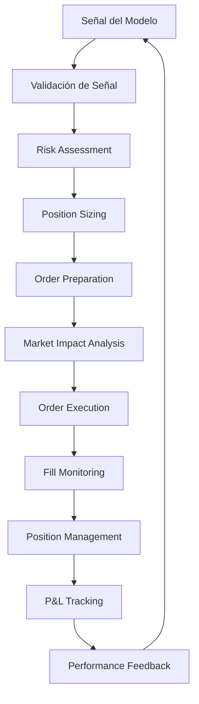

# 📁 trading/ - Sistema de Ejecución de Trading

> **Propósito**: Motor de ejecución que convierte las predicciones del modelo ML en operaciones reales de trading, con gestión avanzada de riesgo y optimización de ejecución.

## 🎯 ORGANIZACIÓN DE ARCHIVOS

```
trading/
├── __init__.py                    # Inicialización del módulo
├── bitget_client.py              # 🔌 Cliente API robusto para Bitget
├── executor.py                   # ⚡ Motor principal de ejecución
├── position_manager.py           # 📊 Gestor de posiciones multi-symbol
├── risk_manager.py               # 🛡️ Gestor de riesgo inteligente
├── order_manager.py              # 📋 Gestor de órdenes avanzado
├── portfolio_optimizer.py        # ⚖️ Optimizador de portfolio
├── execution_engine.py           # 🚀 Engine de ejecución optimizada
├── signal_processor.py           # 🎯 Procesador de señales del modelo
├── market_impact_analyzer.py     # 📊 Analizador de impacto de mercado
├── latency_optimizer.py          # ⚡ Optimizador de latencia
├── slippage_analyzer.py          # 📈 Analizador de slippage
├── emergency_manager.py          # 🚨 Gestor de emergencias
├── trade_logger.py               # 📝 Logger detallado de trades
├── performance_tracker.py        # 📊 Tracker de performance en tiempo real
└── README.md                     # 📄 Esta documentación
```

## 🔧 FUNCIONALIDADES PRINCIPALES

### **1. bitget_client.py - Cliente API Robusto**
```python
Responsabilidades:
├── 🔐 Autenticación segura con Bitget
├── 📊 Obtención de datos de mercado en tiempo real
├── 💰 Gestión de balance y posiciones
├── 📋 Ejecución de todos los tipos de órdenes
├── 🔄 Manejo robusto de reconexiones
├── 📝 Logging detallado de todas las operaciones
├── 🚨 Manejo de errores y rate limiting
└── ⚡ Optimización de latencia
```

**Funciones Principales:**
- `place_order()`: Ejecutar órdenes con retry logic
- `get_account_balance()`: Obtener balance actual
- `get_open_positions()`: Posiciones abiertas
- `cancel_order()`: Cancelar órdenes
- `get_order_status()`: Estado de órdenes
- `get_market_data()`: Datos de mercado

### **2. executor.py - Motor Principal de Ejecución**
```python
Responsabilidades:
├── 🎯 Procesar señales del modelo ML
├── ⚡ Ejecutar decisiones de trading
├── 🛡️ Aplicar reglas de risk management
├── 📊 Coordinar entre múltiples símbolos
├── 🔄 Gestionar el ciclo completo de trades
├── 📈 Optimizar timing de ejecución
├── 🚨 Manejar situaciones de emergencia
└── 📝 Reportar resultados al sistema de aprendizaje
```

**Flujo de Ejecución:**
```python
Signal → Risk Check → Position Sizing → Order Execution → Monitoring → Closure
```

### **3. position_manager.py - Gestor de Posiciones**
```python
Responsabilidades:
├── 📊 Tracking de posiciones abiertas por símbolo
├── 💲 Cálculo de P&L en tiempo real
├── 🎯 Gestión de stop loss y take profit
├── 🔄 Trailing stops inteligentes
├── ⚖️ Balanceo de exposición entre símbolos
├── 📈 Escalado de posiciones (scaling in/out)
├── 🕐 Gestión de timeouts de posiciones
└── 📋 Reportes detallados de performance
```

**Estados de Posición:**
- `OPENING`: Orden enviada, esperando fill
- `OPEN`: Posición activa
- `SCALING`: Escalando posición (parcial fills)
- `CLOSING`: Cerrando posición
- `CLOSED`: Posición cerrada

### **4. risk_manager.py - Gestor de Riesgo**
```python
Responsabilidades:
├── 💰 Cálculo de position sizing óptimo
├── 📉 Monitoreo de drawdown en tiempo real
├── 🚨 Emergency shutdown si límites excedidos
├── 🔄 Análisis de correlaciones entre posiciones
├── ⏰ Límites temporales (diarios/semanales)
├── 📊 Cálculo de VaR (Value at Risk)
├── 🎯 Risk-adjusted position sizing
└── 🛡️ Protección multicapa del capital
```

**Niveles de Protección:**
1. **Trade Level**: Stop loss, position size
2. **Symbol Level**: Exposición máxima por símbolo
3. **Portfolio Level**: Exposición total, correlaciones
4. **Account Level**: Drawdown total, emergency stop

## ⚡ SISTEMA DE EJECUCIÓN

### **Flujo de Decisión Completo**


### **Tipos de Órdenes Soportadas**
```python
Order Types:
├── 🎯 Market Orders: Ejecución inmediata
├── 📊 Limit Orders: Mejor precio posible
├── 🛡️ Stop Loss Orders: Protección de pérdidas
├── 📈 Take Profit Orders: Realización de ganancias
├── 🔄 Trailing Stop Orders: Stops dinámicos
├── 🎪 OCO Orders: One-Cancels-Other
├── 📋 Iceberg Orders: Ocultar tamaño real
└── ⏰ Time-based Orders: Orders con expiración
```

### **Smart Order Routing**
```python
Routing Logic:
├── 📊 Análisis de liquidez en tiempo real
├── 💰 Minimización de market impact
├── ⚡ Optimización de timing
├── 🎯 Fragmentación inteligente de órdenes
├── 🔄 Dynamic order sizing
├── 📈 TWAP/VWAP strategies
└── 🚨 Emergency routing protocols
```

## 🛡️ GESTIÓN DE RIESGO AVANZADA

### **Position Sizing Algorithms**
```python
Sizing Methods:
├── 🎯 Kelly Criterion: Óptimo matemático
├── 📊 Fixed Percentage: % fijo del capital
├── 🌊 Volatility-based: Basado en ATR
├── 💪 Confidence-based: Basado en confidence del modelo
├── 🔄 Adaptive Sizing: Ajuste dinámico
├── ⚖️ Risk Parity: Igual riesgo por posición
└── 🎪 Portfolio Optimization: Markowitz optimal
```

### **Risk Metrics Monitoring**
```python
Real-time Risk Metrics:
├── 📊 Portfolio VaR: Value at Risk
├── 📉 Maximum Drawdown: Pérdida máxima
├── 🎯 Sharpe Ratio: Retorno ajustado por riesgo
├── 💰 Position Concentration: % por símbolo
├── 🔄 Correlation Exposure: Riesgo de correlación
├── ⏰ Time-based Risk: Exposición temporal
└── 🌊 Volatility Exposure: Exposición a volatilidad
```

### **Emergency Protocols**
```python
Emergency Scenarios:
├── 🚨 Flash Crash Detection: Caída >5% en 1min
├── 📉 Drawdown Breach: >15% drawdown total
├── 🔌 API Disconnection: Pérdida de conectividad
├── 💥 Model Failure: Predicciones erróneas
├── 🌊 High Volatility: VIX >30 (equivalente crypto)
├── 📰 News Events: Eventos de mercado importantes
└── 🔄 System Overload: Sobrecarga computacional
```

## 📊 OPTIMIZACIÓN DE EJECUCIÓN

### **Latency Optimization**
```python
Latency Reduction:
├── ⚡ Direct API connections: Sin intermediarios
├── 🌐 Geographic proximity: Servidores cerca del exchange
├── 💾 Connection pooling: Reutilizar conexiones
├── 📊 Async processing: Operaciones asíncronas
├── 🔄 Pre-computed orders: Orders pre-calculadas
├── 🎯 Smart routing: Routing optimizado
└── 📈 Hardware acceleration: FPGA/GPU si disponible
```

### **Slippage Minimization**
```python
Slippage Control:
├── 📊 Real-time spread analysis: Análisis de spreads
├── 💰 Order book analysis: Profundidad del libro
├── ⏰ Timing optimization: Mejor momento para ejecutar
├── 🎯 Size optimization: Tamaño óptimo de orden
├── 🔄 Fragmentation strategies: Fragmentar órdenes grandes
├── 📈 Market impact modeling: Modelar impacto
└── 🎪 Adaptive algorithms: Algoritmos adaptativos
```

## 📈 MULTI-SYMBOL TRADING

### **Portfolio Management**
```python
Multi-Symbol Coordination:
├── ⚖️ Dynamic allocation: Asignación dinámica de capital
├── 🔄 Correlation management: Gestión de correlaciones
├── 🎯 Opportunity prioritization: Priorizar oportunidades
├── 📊 Risk distribution: Distribución de riesgo
├── 💰 Capital efficiency: Uso eficiente del capital
├── 🕐 Timing coordination: Coordinar timing entre símbolos
└── 🚨 Conflict resolution: Resolver conflictos entre señales
```

### **Symbol-Specific Configurations**
```yaml
# Ejemplo de configuración por símbolo
symbols:
  BTCUSDT:
    max_position_size: 0.03     # 3% máximo
    min_confidence: 0.65        # 65% confianza mínima
    stop_loss_pct: 0.02         # 2% stop loss
    take_profit_levels:         # TP escalonado
      - target: 0.02, close_pct: 33
      - target: 0.04, close_pct: 50
      - target: 0.08, close_pct: 100
    
  ETHUSDT:
    max_position_size: 0.025
    min_confidence: 0.70        # ETH requiere más confianza
    stop_loss_pct: 0.025        # ETH más volátil
```

## 🔮 FUNCIONALIDADES AVANZADAS

### **Machine Learning Integration**
```python
ML-Trading Integration:
├── 🧠 Real-time predictions: Predicciones en tiempo real
├── 📊 Confidence-based sizing: Tamaño basado en confianza
├── 🎯 Dynamic thresholds: Umbrales adaptativos
├── 🔄 Feedback loop: Retroalimentación al modelo
├── 📈 Performance attribution: Atribución de performance
├── 🎪 Strategy selection: Selección de estrategia
└── 🚨 Model health monitoring: Monitoreo de salud del modelo
```

### **Advanced Order Types**
```python
Planned Advanced Orders:
├── 🧠 AI-powered orders: Órdenes con IA
├── 📊 Conditional orders: Basadas en múltiples condiciones
├── 🔄 Algorithmic orders: TWAP, VWAP, Implementation Shortfall
├── 🎯 Smart stops: Stops inteligentes con ML
├── 📈 Dynamic sizing: Tamaño que cambia con el mercado
└── 🌊 Volatility-adaptive: Adaptativos a volatilidad
```

## 📊 MONITOREO Y ANÁLISIS

### **Real-time Monitoring**
```python
Monitoring Dashboard:
├── 💰 P&L en tiempo real por símbolo
├── 📊 Exposición actual del portfolio
├── 🎯 Métricas de riesgo live
├── ⚡ Latencia de ejecución
├── 📈 Fill rates y slippage
├── 🔄 Status de órdenes activas
└── 🚨 Alertas de risk management
```

### **Performance Analytics**
```python
Performance Metrics:
├── 📊 Sharpe Ratio por símbolo
├── 💰 Total return vs benchmark
├── 📉 Maximum drawdown periods
├── 🎯 Win rate por tipo de trade
├── ⚡ Average trade duration
├── 💸 Trading costs analysis
└── 🔄 Model prediction accuracy
```

## 🛠️ GUÍAS DE USO

### **Para Desarrolladores (Cursor/Claude)**

#### **Ejecutar trade básico:**
```python
from trading.executor import TradingExecutor

executor = TradingExecutor()

# Ejecutar señal del modelo
result = await executor.execute_signal(
    symbol="BTCUSDT",
    action="BUY",
    confidence=0.85,
    expected_return=0.03
)
```

#### **Gestión de posiciones:**
```python
from trading.position_manager import PositionManager

pos_manager = PositionManager()

# Obtener posiciones abiertas
positions = pos_manager.get_open_positions()

# Cerrar posición específica
await pos_manager.close_position(
    symbol="BTCUSDT",
    reason="take_profit"
)
```

#### **Monitoreo de riesgo:**
```python
from trading.risk_manager import RiskManager

risk_manager = RiskManager()

# Verificar si trade es permitido
is_allowed = risk_manager.check_trade_allowed(
    symbol="BTCUSDT",
    side="BUY",
    size=0.02
)

# Obtener métricas de riesgo actuales
risk_metrics = risk_manager.get_current_risk_metrics()
```

### **Configuración de Trading**

#### **En user_settings.yaml:**
```yaml
trading_settings:
  execution:
    max_slippage_bps: 10          # 10 basis points
    order_timeout_seconds: 30      # Timeout de órdenes
    retry_attempts: 3              # Reintentos en errores
    
  risk_management:
    max_portfolio_exposure: 0.8    # 80% máximo invertido
    max_correlated_exposure: 0.4   # 40% en activos correlacionados
    emergency_stop_drawdown: 0.15  # Stop en 15% drawdown
    
  position_management:
    default_stop_loss: 0.02        # 2% stop loss por defecto
    trailing_stop_activation: 0.01 # Activar trailing en 1% ganancia
    partial_close_thresholds: [0.02, 0.04, 0.08]  # TP escalonado
```

## 🚨 GESTIÓN DE ERRORES

### **Error Recovery Strategies**
```python
Error Handling:
├── 🔌 Network Errors → Reconnect automático
├── 📊 Order Rejection → Retry con ajustes
├── 💰 Insufficient Balance → Reduce position size
├── 🔄 Rate Limiting → Backoff exponencial
├── 🚨 Exchange Errors → Fallback exchanges
├── 💥 Critical Errors → Emergency shutdown
└── 🧮 Calculation Errors → Safe defaults
```

### **Monitoring & Alerting**
```python
Alert Conditions:
├── 🚨 High slippage detected
├── 📉 Unusual drawdown patterns
├── ⚡ High latency warnings
├── 🔄 Order fill rate drops
├── 💰 Balance discrepancies
├── 🎯 Model prediction accuracy drops
└── 🔌 API connectivity issues
```

---

**📝 Nota para Cursor**: Este módulo maneja dinero real. Cada función debe tener múltiples validaciones y error handling robusto. Priorizar siempre la protección del capital sobre las ganancias potenciales. Todos los trades deben ser auditables y reversibles.